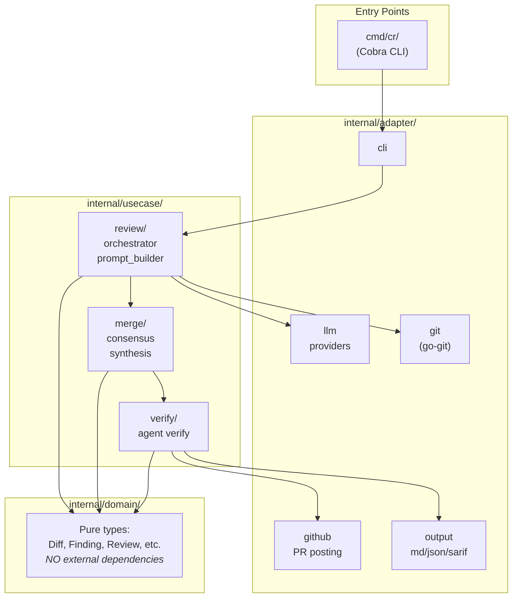
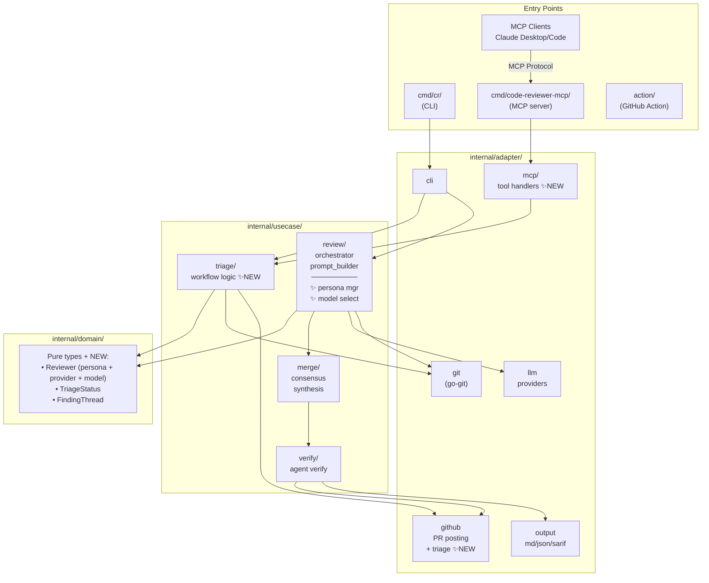
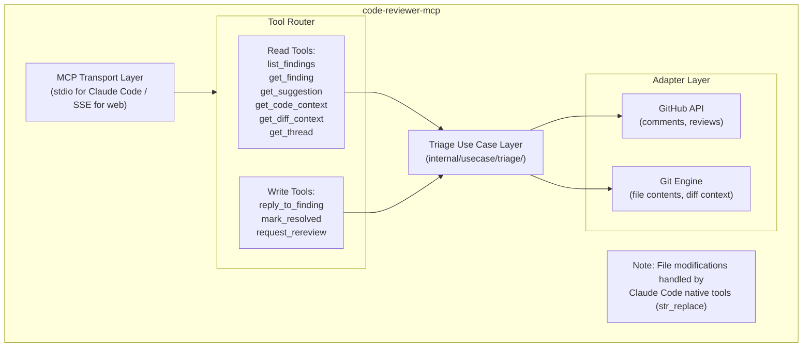
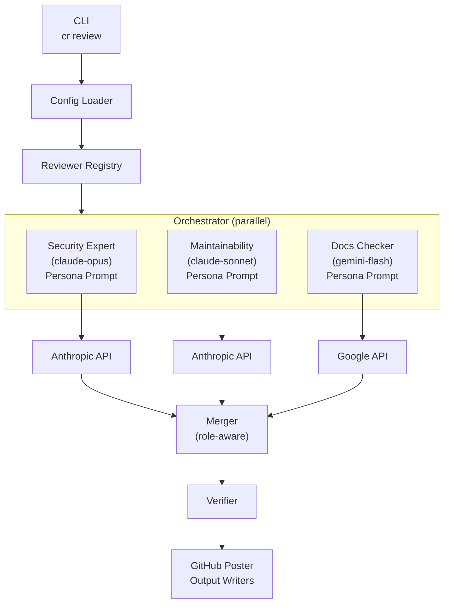
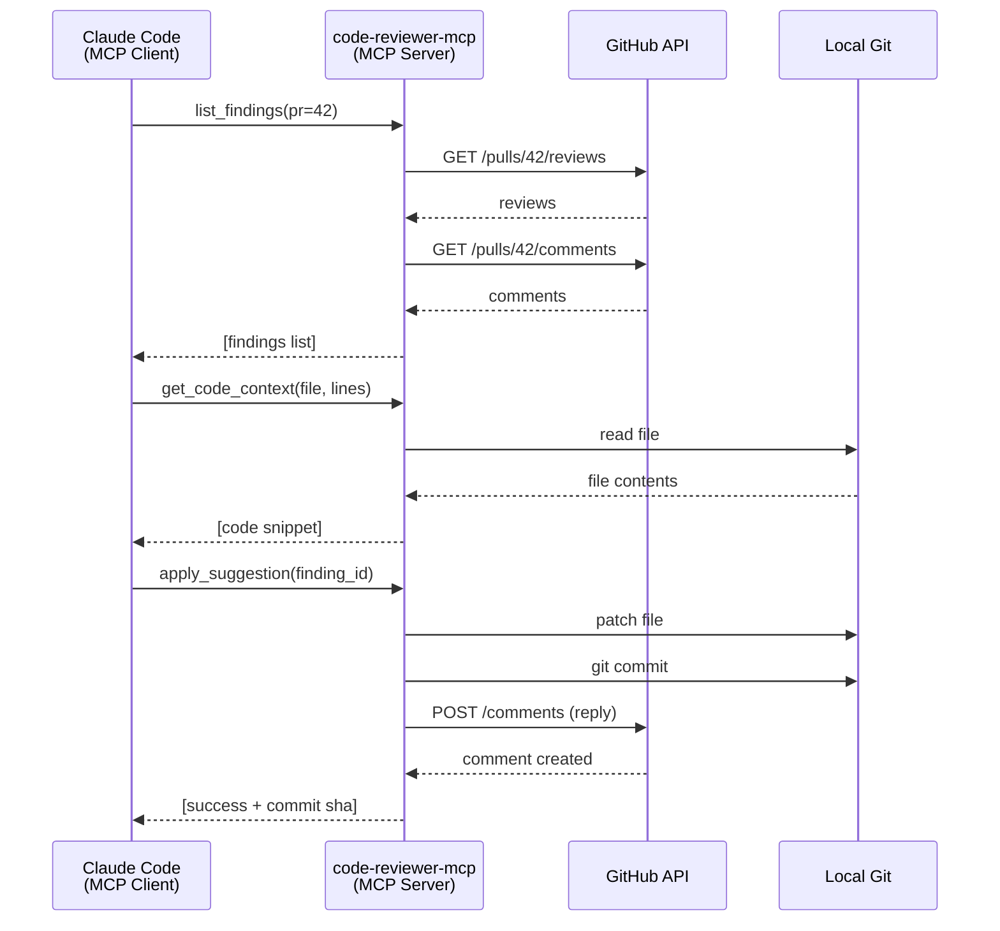
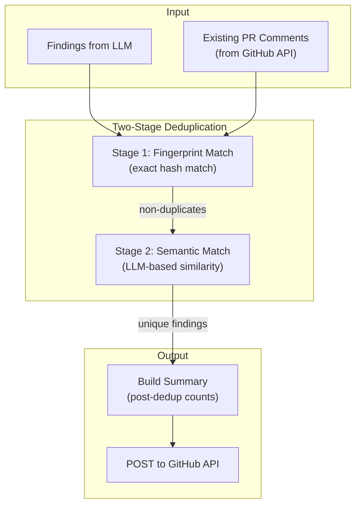

# Architecture Document: Code-Reviewer Phase 3

**Version:** 0.2
**Date:** 2025-12-31
**Author:** Brandon Young
**Status:** Phase 3.1 & 3.2 Complete (v0.6.3)

---

## 1. Overview

This document describes the architectural changes required for Phase 3 of code-reviewer. It builds on the existing clean architecture foundation while introducing new components for triage automation and intelligent review orchestration.

### Design Principles (Unchanged)

- **Clean Architecture** — Domain has no external dependencies
- **Modularity** — Clear responsibilities, loose coupling
- **Extensibility** — Easy to add new capabilities
- **Security-First** — Redaction, auth, audit trails
- **Testability** — Dependency injection, interfaces

---

## 2. Current Architecture (v0.6.3)



### Current Data Flow

1. **CLI** → `cr review branch main`
2. **Git Engine** → Produces cumulative diff
3. **Redaction** → Sanitizes secrets from diff
4. **Context Builder** → Assembles prompt with docs
5. **Orchestrator** → Dispatches to LLM providers in parallel
6. **Merger** → Synthesizes consensus review
7. **Verifier** → (Optional) Filters false positives
8. **GitHub Poster** → Posts inline comments, review status
9. **Output Writers** → Markdown, JSON, SARIF files

---

## 3. Phase 3 Architecture

### 3.1 Components Overview



---

## 4. Component Details

### 4.1 MCP Server (`cmd/code-reviewer-mcp/`)

A standalone binary that implements the Model Context Protocol, exposing triage operations as tools.



#### Key Design Decisions

**Separate Binary:** The MCP server is a separate binary (`code-reviewer-mcp`) rather than a subcommand of `cr`. This allows:
- Independent deployment and versioning
- Cleaner separation of concerns
- Easier testing of MCP protocol handling
- Configuration via MCP standard mechanisms

**Shared Libraries:** Both `cr` and `code-reviewer-mcp` share:
- `internal/domain/` — Types
- `internal/adapter/github/` — GitHub API client
- `internal/adapter/git/` — Git operations
- `internal/usecase/triage/` — Triage logic

**Authentication:**
- GitHub token passed via environment variable (`GITHUB_TOKEN`)
- Repository context from working directory or explicit config
- No secrets stored in MCP server state

---

### 4.2 Triage Use Case (`internal/usecase/triage/`)

Core business logic for triage operations, independent of transport (MCP or CLI).

```go
// Package triage provides use cases for triaging review findings.
package triage

// Service coordinates triage operations.
type Service struct {
    github   GitHubClient    // Comment CRUD, review status
    git      GitEngine       // File contents, diff context
    store    Store           // Optional: triage history
}

// Finding represents a review finding with triage state.
type Finding struct {
    ID          string
    CommentID   int64
    File        string
    LineStart   int
    LineEnd     int
    Severity    string
    Category    string
    Description string
    Suggestion  string
    Status      TriageStatus
    ThreadState ThreadState
}

// TriageStatus represents the disposition of a finding.
type TriageStatus string

const (
    StatusOpen         TriageStatus = "open"
    StatusAcknowledged TriageStatus = "acknowledged"
    StatusAccepted     TriageStatus = "accepted"
    StatusDisputed     TriageStatus = "disputed"
    StatusWontFix      TriageStatus = "wont_fix"
    StatusQuestion     TriageStatus = "question"
    StatusResolved     TriageStatus = "resolved"
)

// ThreadState captures the conversation state from GitHub.
type ThreadState struct {
    IsResolved    bool
    ReplyCount    int
    LastReplyBy   string
    LastReplyAt   time.Time
}
```

#### Core Operations

```go
// ListFindings returns findings for a PR with optional filters.
func (s *Service) ListFindings(ctx context.Context, req ListRequest) ([]Finding, error)

// GetFinding returns a single finding with full context.
func (s *Service) GetFinding(ctx context.Context, id string) (*FindingDetail, error)

// GetCodeContext returns the current code at a location.
func (s *Service) GetCodeContext(ctx context.Context, file string, start, end int) (string, error)

// GetDiffContext returns the diff hunk for a location.
func (s *Service) GetDiffContext(ctx context.Context, file string, start, end int) (string, error)

// GetSuggestion extracts structured suggestion data for applying via str_replace.
// Returns exact original code and suggested replacement, resilient to line drift.
func (s *Service) GetSuggestion(ctx context.Context, findingID string) (*SuggestionBlock, error)

// ReplyToFinding adds a reply and optionally sets status.
func (s *Service) ReplyToFinding(ctx context.Context, req ReplyRequest) error

// MarkResolved marks a finding as resolved.
func (s *Service) MarkResolved(ctx context.Context, commentID int64) error

// RequestRereview dismisses stale reviews and requests fresh review.
func (s *Service) RequestRereview(ctx context.Context, prNumber int) error

// Note: File modifications (apply_suggestion, batch_apply) are handled by
// Claude Code's native tools (str_replace, edit_file) using data from GetSuggestion.
```

---

### 4.3 Reviewer Personas (`internal/usecase/review/`)

Extend the orchestrator to support specialized reviewers.

```go
// Reviewer represents a specialized review perspective.
type Reviewer struct {
    Name     string           // e.g., "security-expert"
    Provider string           // e.g., "anthropic"
    Model    string           // e.g., "claude-opus-4"
    Weight   float64          // Finding weight in merge (default: 1.0)
    Persona  string           // System prompt describing expertise
    Focus    []string         // Categories to look for
    Ignore   []string         // Categories to skip
}

// ReviewerRegistry manages reviewer definitions.
type ReviewerRegistry struct {
    reviewers map[string]Reviewer
    defaults  []string  // Default reviewers when none specified
}

// PersonaPromptBuilder generates prompts tailored to each reviewer.
type PersonaPromptBuilder struct {
    baseBuilder PromptBuilder  // Existing prompt builder
}

func (b *PersonaPromptBuilder) Build(
    ctx ProjectContext,
    diff domain.Diff,
    req BranchRequest,
    reviewer Reviewer,
) (ProviderRequest, error) {
    // Start with base prompt
    base, err := b.baseBuilder(ctx, diff, req, reviewer.Provider)
    if err != nil {
        return ProviderRequest{}, err
    }
    
    // Inject persona
    prompt := injectPersona(base.Prompt, reviewer)
    
    // Add focus/ignore instructions
    prompt = addFocusInstructions(prompt, reviewer.Focus, reviewer.Ignore)
    
    return ProviderRequest{
        Prompt:  prompt,
        Seed:    base.Seed,
        MaxSize: base.MaxSize,
    }, nil
}
```

#### Orchestrator Changes

```go
// ReviewBranch now accepts reviewers instead of (or in addition to) providers
func (o *Orchestrator) ReviewBranch(ctx context.Context, req BranchRequest) (Result, error) {
    // Get reviewers from config (new path) or fall back to providers (legacy)
    reviewers := o.resolveReviewers(req)
    
    // Dispatch to each reviewer in parallel
    for _, reviewer := range reviewers {
        wg.Add(1)
        go func(r Reviewer) {
            defer wg.Done()
            
            // Build persona-specific prompt
            providerReq, err := o.personaBuilder.Build(ctx, diff, req, r)
            
            // Get provider for this reviewer
            provider := o.deps.Providers[r.Provider]
            
            // Execute review
            review, err := provider.Review(ctx, providerReq)
            
            // Tag review with reviewer metadata
            review.ReviewerName = r.Name
            review.ReviewerWeight = r.Weight
            
            // ...
        }(reviewer)
    }
    
    // Merge with awareness of reviewer roles
    mergedReview := o.deps.Merger.MergeWithRoles(ctx, reviews)
    
    // ...
}
```

---

### 4.4 Model Selector (`internal/usecase/review/`)

Dynamically select models based on change characteristics.

```go
// ModelSelector chooses the appropriate model for a review context.
type ModelSelector interface {
    SelectModel(ctx context.Context, req SelectionRequest) (Selection, error)
}

// SelectionRequest contains factors for model selection.
type SelectionRequest struct {
    TokenEstimate   int              // Estimated tokens in diff
    ChangeTypes     []string         // Detected change types (security, docs, etc.)
    CostBudget      float64          // Max cost for this review
    LatencyBudget   time.Duration    // Max acceptable latency
    PreferredModels []string         // User preferences
}

// Selection is the chosen model with rationale.
type Selection struct {
    Provider   string
    Model      string
    Rationale  string  // Why this model was chosen
    Estimated  Cost    // Expected cost
}

// DefaultModelSelector implements token-tier and change-type routing.
type DefaultModelSelector struct {
    config ModelSelectionConfig
}

func (s *DefaultModelSelector) SelectModel(ctx context.Context, req SelectionRequest) (Selection, error) {
    // 1. Filter by token capacity
    candidates := s.filterByTokenCapacity(req.TokenEstimate)
    
    // 2. Boost models preferred for detected change types
    candidates = s.boostByChangeType(candidates, req.ChangeTypes)
    
    // 3. Filter by cost budget
    candidates = s.filterByCost(candidates, req.CostBudget)
    
    // 4. Filter by latency budget
    candidates = s.filterByLatency(candidates, req.LatencyBudget)
    
    // 5. Select best remaining candidate
    return s.selectBest(candidates)
}
```

---

## 5. Configuration Schema

### 5.1 Reviewers Configuration

```yaml
# cr.yaml - Phase 3 configuration

# Legacy providers section (deprecated, still supported)
# providers:
#   openai:
#     model: "gpt-4o"

# New reviewers section
reviewers:
  # Security specialist
  security:
    provider: anthropic
    model: claude-opus-4
    weight: 1.5
    persona: |
      You are a security-focused code reviewer with expertise in:
      - OWASP Top 10 vulnerabilities
      - Authentication and authorization flaws
      - Injection attacks (SQL, command, XSS)
      - Secrets and credential exposure
      - Cryptographic weaknesses
      
      Focus ONLY on security issues. Ignore style, performance, and 
      general code quality unless they have security implications.
      
      When you find an issue, cite the specific CWE or OWASP category.
    focus:
      - security
      - authentication
      - authorization
      - injection
      - secrets
    ignore:
      - style
      - naming
      - documentation
      - performance

  # Maintainability advisor
  maintainability:
    provider: anthropic
    model: claude-sonnet-4-5
    weight: 1.0
    persona: |
      You are a maintainability expert focused on long-term code health.
      Look for:
      - DRY violations and code duplication
      - SOLID principle violations
      - Overly complex functions (cyclomatic complexity)
      - Poor naming that hurts readability
      - Missing or inadequate error handling
      
      Do NOT comment on security, performance, or documentation.
    focus:
      - maintainability
      - dry-violations
      - solid-principles
      - complexity
      - error-handling
    ignore:
      - security
      - performance
      - documentation

  # Documentation checker (cheap, fast)
  docs:
    provider: google
    model: gemini-2.0-flash
    weight: 0.5
    persona: |
      Review ONLY comments, docstrings, and documentation.
      Check for:
      - Spelling and grammar errors
      - Outdated or inaccurate documentation
      - Missing documentation for public APIs
      - Clarity and completeness
      
      Do NOT review code logic or structure.
    focus:
      - documentation
      - comments
    ignore:
      - security
      - bugs
      - performance
      - maintainability

# Default reviewers when not specified in CLI
default_reviewers:
  - security
  - maintainability
```

### 5.2 Model Selection Configuration

```yaml
# Model selection (Phase 3.3)
model_selection:
  enabled: true
  strategy: balanced  # balanced, cost, quality, speed
  
  # Token-based tier selection
  token_tiers:
    - max_tokens: 1000
      prefer:
        - google/gemini-2.0-flash
        - openai/gpt-4o-mini
      reason: "Small changes - use fast, cheap models"
    
    - max_tokens: 10000
      prefer:
        - anthropic/claude-sonnet-4-5
        - openai/gpt-4o
      reason: "Medium changes - balanced models"
    
    - max_tokens: 100000
      prefer:
        - google/gemini-2.0-pro
        - anthropic/claude-opus-4
      reason: "Large changes - big context models"
  
  # Change-type specific routing
  change_type_routing:
    security:
      prefer:
        - anthropic/claude-opus-4
        - openai/gpt-4o
      reason: "Security requires strongest models"
    
    documentation:
      prefer:
        - google/gemini-2.0-flash
      reason: "Docs don't need expensive models"
    
    tests:
      prefer:
        - anthropic/claude-sonnet-4-5
      reason: "Test review benefits from code understanding"
```

---

## 6. Data Flow Diagrams

### 6.1 Review Flow (with Personas)



### 6.2 Triage Flow (MCP)



### 6.3 GitHub Posting Flow (with Deduplication)

The GitHub Poster handles posting review findings as inline PR comments. Understanding this flow is critical because **GitHub PR comments accumulate forever** — they persist even after reviews are dismissed or code is fixed.



#### Critical Behavior: Comment Accumulation (Issue #125)

**GitHub API Behavior:**
- PR comments **never disappear**, even when:
  - The review is dismissed
  - The code is fixed
  - A new review is posted
- Each `CreateReview` API call creates **new** inline comments
- Dismissing a review only changes its state; comments remain visible

**Implication:** Without deduplication, each review cycle posts duplicate comments for the same issues.

#### Two-Stage Deduplication

| Stage | Method | Catches | Performance |
|-------|--------|---------|-------------|
| **Stage 1: Fingerprint** | SHA-256 hash of `file + category + severity + description[0:100]` | Exact duplicates | O(1) lookup |
| **Stage 2: Semantic** | LLM comparison (Claude Haiku) | Same issue, different wording | ~2s per batch |

**Why both stages?**
- LLMs generate varied wording for the same issue across runs
- Example: "constructs with nil dependencies" vs "started with nil dependencies"
- These have different fingerprints but are semantically identical

#### Summary Generation Timing

**Critical:** The programmatic summary must be built **AFTER** deduplication.

```go
// WRONG: Summary shows raw findings (stale counts)
summary := BuildProgrammaticSummary(rawFindings, diff)
findings = deduplicate(rawFindings, existingComments)
post(summary, findings)  // Summary says "17 findings" but only 3 posted

// CORRECT: Summary reflects what's actually posted
findings = deduplicate(rawFindings, existingComments)
summary := BuildProgrammaticSummary(findings, diff)  // After dedup!
post(summary, findings)  // Summary says "3 findings" matching posts
```

#### Configuration

```yaml
deduplication:
  semantic:
    enabled: true                    # Default: true
    provider: anthropic              # Default: anthropic
    model: claude-haiku-4-5          # Default: claude-haiku-4-5
    maxTokens: 64000                 # Default: 64000
    lineThreshold: 10                # Max line distance for candidates
    maxCandidates: 50                # Cost guard per review
```

---

## 7. Interface Definitions

### 7.1 MCP Tool Schemas

```json
{
  "tools": [
    {
      "name": "list_findings",
      "description": "List review findings on a PR with optional filters",
      "inputSchema": {
        "type": "object",
        "properties": {
          "pr_number": {
            "type": "integer",
            "description": "Pull request number"
          },
          "status": {
            "type": "string",
            "enum": ["open", "acknowledged", "accepted", "disputed", "wont_fix", "resolved"],
            "description": "Filter by triage status"
          },
          "severity": {
            "type": "string", 
            "enum": ["critical", "high", "medium", "low"],
            "description": "Filter by severity"
          },
          "category": {
            "type": "string",
            "description": "Filter by category (e.g., security, maintainability)"
          }
        },
        "required": ["pr_number"]
      }
    },
    {
      "name": "get_finding",
      "description": "Get detailed information about a specific finding",
      "inputSchema": {
        "type": "object",
        "properties": {
          "finding_id": {
            "type": "string",
            "description": "Finding ID (fingerprint) or GitHub comment ID"
          }
        },
        "required": ["finding_id"]
      }
    },
    {
      "name": "get_code_context",
      "description": "Get the current code at a finding's location",
      "inputSchema": {
        "type": "object",
        "properties": {
          "file": {
            "type": "string",
            "description": "File path"
          },
          "line_start": {
            "type": "integer",
            "description": "Starting line number"
          },
          "line_end": {
            "type": "integer",
            "description": "Ending line number"
          },
          "context_lines": {
            "type": "integer",
            "default": 5,
            "description": "Additional lines of context above/below"
          }
        },
        "required": ["file", "line_start", "line_end"]
      }
    },
    {
      "name": "reply_to_finding",
      "description": "Reply to a finding with a status update",
      "inputSchema": {
        "type": "object",
        "properties": {
          "comment_id": {
            "type": "integer",
            "description": "GitHub comment ID to reply to"
          },
          "body": {
            "type": "string",
            "description": "Reply text"
          },
          "status": {
            "type": "string",
            "enum": ["acknowledged", "accepted", "disputed", "wont_fix", "question"],
            "description": "Triage status to set"
          }
        },
        "required": ["comment_id", "body"]
      }
    },
    {
      "name": "apply_suggestion",
      "description": "Apply a suggested fix from a finding",
      "inputSchema": {
        "type": "object",
        "properties": {
          "finding_id": {
            "type": "string",
            "description": "Finding ID with the suggestion"
          },
          "create_commit": {
            "type": "boolean",
            "default": true,
            "description": "Create a git commit with the fix"
          },
          "commit_message": {
            "type": "string",
            "description": "Custom commit message (auto-generated if not provided)"
          }
        },
        "required": ["finding_id"]
      }
    },
    {
      "name": "batch_apply",
      "description": "Apply multiple suggestions in a single commit",
      "inputSchema": {
        "type": "object",
        "properties": {
          "finding_ids": {
            "type": "array",
            "items": {"type": "string"},
            "description": "List of finding IDs to apply"
          },
          "commit_message": {
            "type": "string",
            "description": "Commit message for the batch"
          }
        },
        "required": ["finding_ids"]
      }
    },
    {
      "name": "request_rereview",
      "description": "Dismiss stale reviews and request a fresh review",
      "inputSchema": {
        "type": "object",
        "properties": {
          "pr_number": {
            "type": "integer",
            "description": "Pull request number"
          }
        },
        "required": ["pr_number"]
      }
    }
  ]
}
```

---

## 8. Security Considerations

### 8.1 MCP Server Security

| Risk | Mitigation |
|------|------------|
| Unauthorized access | Require `GITHUB_TOKEN` with appropriate scopes |
| Token exposure | Never log or return tokens; use env vars |
| Repository scope | Validate all operations against current repo context |
| Malicious suggestions | `apply_suggestion` only applies code from review, not arbitrary patches |

### 8.2 Reviewer Persona Security

| Risk | Mitigation |
|------|------------|
| Prompt injection via persona | Validate persona content; no executable code |
| Persona leaking secrets | Redaction applies before persona prompt assembly |
| Malicious focus/ignore config | Validate against known category list |

---

## 9. Testing Strategy

### 9.1 Unit Tests

- Triage service operations with mock GitHub/Git clients
- Persona prompt builder with various configurations
- Model selector with different input scenarios
- MCP tool handlers with mock service

### 9.2 Integration Tests

- MCP server end-to-end with test GitHub repository
- Full review flow with multiple reviewers
- Triage flow applying real suggestions

### 9.3 Contract Tests

- MCP protocol compliance (tool schemas, responses)
- GitHub API compatibility (mock vs real)

---

## 10. Migration Path

### 10.1 Config Migration

```yaml
# Old config (v0.4.x)
providers:
  openai:
    enabled: true
    model: "gpt-4o"
  anthropic:
    enabled: true
    model: "claude-sonnet-4-5"

# New config (v0.5.x) - equivalent behavior
reviewers:
  openai-default:
    provider: openai
    model: gpt-4o
    weight: 1.0
    # No persona = generic review prompt
    
  anthropic-default:
    provider: anthropic
    model: claude-sonnet-4-5
    weight: 1.0
```

### 10.2 CLI Migration

| Old Command | New Command | Notes |
|-------------|-------------|-------|
| `cr review branch main` | `cr review branch main` | Unchanged, uses new config |
| N/A | `cr review branch main --reviewers security,docs` | Select specific reviewers |
| N/A | `cr triage list --pr 42` | New triage command |

---

## 11. Architecture Decisions (Resolved)

| Decision | Choice | Rationale |
|----------|--------|-----------|
| **MCP binary name** | `code-reviewer-mcp` | Descriptive, matches project naming |
| **Binary renaming** | Support via build flags | Internal code uses `os.Args[0]}` for self-reference; binary name is cosmetic |
| **Persona storage** | Same `cr.yaml` config file | Simpler, version-controlled with rest of config |
| **Triage state** | GitHub-only | Source of truth; enables cross-context flexibility |
| **Tool naming** | Concise with excellent descriptions | `list_findings` not `list_pr_findings`; descriptions carry context |
| **Repo structure** | Shared repo | `cmd/code-reviewer-mcp/` alongside `cmd/cr/` |

---

## 12. Revision History

| Version | Date | Author | Changes |
|---------|------|--------|---------|
| 0.1 | 2025-12-28 | Brandon | Initial draft |
| 0.2 | 2025-12-31 | Brandon | Phase 3.1 & 3.2 complete, added GitHub Action entry point |