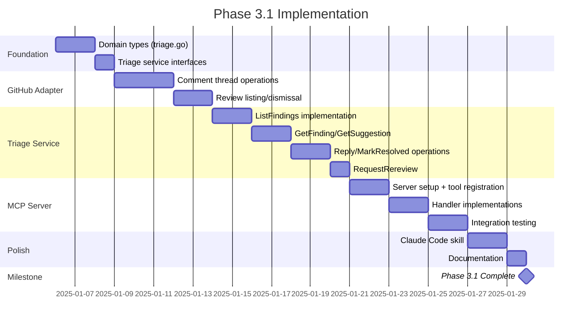

# Technical Design: Phase 3.1 — Triage MCP Server

**Version:** 0.1 (Draft)  
**Date:** 2025-12-28  
**Author:** Brandon Young  
**Status:** In Development

---

## 1. Overview

Phase 3.1 delivers the triage automation capabilities that close the review-to-resolution loop. The primary deliverable is an MCP server (`code-reviewer-mcp`) that exposes triage operations as tools for AI assistants like Claude Code.

### Architecture Philosophy

**Key Insight**: Claude Code already has excellent native capabilities for file editing (`str_replace`, `edit_file`) and git operations (via bash). The MCP server should **not duplicate these capabilities**. Instead, it provides:

1. **Information** — What to change, where, and why (finding details, suggestions)
2. **GitHub Orchestration** — Status updates, comment threading, review management

Claude Code handles the actual file modifications using its native tools, which are more robust and already battle-tested.

```
┌─────────────────────────────────────────────────────┐
│                    Claude Code                       │
│  ┌────────────┐    ┌────────────┐    ┌───────────┐ │
│  │ MCP Client │───▶│ File Edit  │───▶│ Git Ops   │ │
│  │            │    │ (native)   │    │ (native)  │ │
│  └─────┬──────┘    └────────────┘    └───────────┘ │
└────────┼────────────────────────────────────────────┘
         │
         ▼
┌─────────────────┐     ┌────────────┐
│  MCP Server     │────▶│  GitHub    │
│ (info + status) │     │  API       │
└─────────────────┘     └────────────┘
```

This approach:
- Avoids reimplementing file editing
- Leverages Claude Code's resilient text matching (handles line number drift)
- Keeps the MCP server simple and focused
- Works seamlessly with Claude Code's existing workflow

### Deliverables

| Deliverable | Priority | Description |
|-------------|----------|-------------|
| `code-reviewer-mcp` binary | P0 | MCP server exposing triage tools |
| `internal/usecase/triage/` | P0 | Triage business logic (transport-agnostic) |
| `internal/adapter/mcp/` | P0 | MCP tool handlers |
| GitHub adapter extensions | P0 | Comment threading, review status queries |
| `triage-pr-review` skill | P1 | Claude Code skill for effective triage |
| `cr triage` CLI | P2 | Interactive CLI (lower priority) |

### Dependencies

- [mcp-go](https://github.com/mark3labs/mcp-go) — Go MCP SDK
- Existing `internal/adapter/github/` — Extended for triage operations
- Existing `internal/adapter/git/` — File content retrieval

---

## 2. Directory Structure

```
cmd/
├── cr/                          # Existing CLI
│   └── main.go
└── code-reviewer-mcp/           # NEW: MCP server entry point
    └── main.go

internal/
├── adapter/
│   ├── github/
│   │   ├── client.go            # Existing
│   │   ├── types.go             # Existing
│   │   ├── comments.go          # NEW: Comment thread operations
│   │   └── reviews.go           # NEW: Review listing/dismissal
│   ├── git/
│   │   └── engine.go            # Existing (may need extensions)
│   └── mcp/                     # NEW: MCP adapter layer
│       ├── server.go            # MCP server setup
│       ├── tools.go             # Tool registration
│       └── handlers/
│           ├── list_findings.go
│           ├── get_finding.go
│           ├── get_suggestion.go    # Returns structured suggestion data
│           ├── get_code_context.go
│           ├── get_diff_context.go
│           ├── get_thread.go
│           ├── reply_to_finding.go
│           ├── mark_resolved.go
│           └── request_rereview.go
├── domain/
│   └── triage.go                # NEW: Triage domain types
└── usecase/
    └── triage/                  # NEW: Triage use cases
        ├── service.go           # Service orchestration
        ├── finding.go           # Finding operations
        └── interfaces.go        # Port definitions
```

**Note**: No `apply_suggestion` or `batch_apply` handlers — Claude Code uses its native file editing capabilities (`str_replace`, `edit_file`) to apply changes.

---

## 3. Domain Types

```go
// internal/domain/triage.go

package domain

import "time"

// TriageStatus represents the disposition of a finding.
type TriageStatus string

const (
	TriageStatusOpen         TriageStatus = "open"
	TriageStatusAcknowledged TriageStatus = "acknowledged" // Will address later (alias: wont_fix)
	TriageStatusAccepted     TriageStatus = "accepted"     // Implementing fix
	TriageStatusDisputed     TriageStatus = "disputed"     // Disagree with finding
	TriageStatusWontFix      TriageStatus = "wont_fix"     // Intentional/acceptable (alias: acknowledged)
	TriageStatusQuestion     TriageStatus = "question"     // Need clarification
	TriageStatusResolved     TriageStatus = "resolved"     // Fixed and verified
)

// ParseTriageStatus parses a status string, handling aliases.
func ParseTriageStatus(s string) (TriageStatus, bool) {
	switch s {
	case "open":
		return TriageStatusOpen, true
	case "acknowledged", "wont_fix", "wontfix":
		return TriageStatusAcknowledged, true // Normalize aliases
	case "accepted":
		return TriageStatusAccepted, true
	case "disputed":
		return TriageStatusDisputed, true
	case "question", "clarification_request":
		return TriageStatusQuestion, true
	case "resolved":
		return TriageStatusResolved, true
	default:
		return "", false
	}
}

// TriageFinding represents a review finding with triage context.
// This extends the base Finding with GitHub-specific metadata and thread state.
type TriageFinding struct {
	// Core finding data (from review)
	ID          string          // Finding fingerprint
	File        string
	LineStart   int
	LineEnd     int
	Severity    string
	Category    string
	Description string
	Suggestion  string          // Suggested fix (may be empty)

	// GitHub context
	CommentID   int64           // GitHub comment ID
	CommentURL  string          // Direct link to comment
	ReviewID    int64           // Parent review ID
	
	// Triage state (derived from thread)
	Status      TriageStatus
	Thread      ThreadState
}

// ThreadState captures conversation state from GitHub.
type ThreadState struct {
	IsResolved   bool            // GitHub's resolved status
	ReplyCount   int
	Replies      []ThreadReply
	LastReplyBy  string
	LastReplyAt  time.Time
}

// ThreadReply represents a single reply in a finding thread.
type ThreadReply struct {
	ID        int64
	Author    string
	Body      string
	CreatedAt time.Time
	// Parsed status from reply body (if present)
	DeclaredStatus TriageStatus
}

// SuggestionBlock represents a code suggestion ready for Claude Code to apply.
// Contains exact text for str_replace matching (resilient to line number drift).
type SuggestionBlock struct {
	FindingID     string  // Reference back to the finding
	File          string  // File path relative to repo root
	LineStart     int     // Original line start (for reference only)
	LineEnd       int     // Original line end (for reference only)
	OriginalCode  string  // Exact code to find and replace
	SuggestedCode string  // Replacement code
	ContextBefore string  // Lines before for verification (optional)
	ContextAfter  string  // Lines after for verification (optional)
}

// Note: No ApplyResult type - Claude Code handles file modifications
// using its native str_replace/edit_file tools and reports success/failure directly.
```

---

## 4. Use Case Layer

### 4.1 Service Interface

```go
// internal/usecase/triage/interfaces.go

package triage

import (
	"context"
	"time"
	
	"github.com/bkyoung/code-reviewer/internal/domain"
)

// GitHubClient defines GitHub operations needed for triage.
type GitHubClient interface {
	// Reviews
	ListReviews(ctx context.Context, owner, repo string, prNumber int) ([]ReviewSummary, error)
	DismissReview(ctx context.Context, owner, repo string, prNumber int, reviewID int64, message string) error
	
	// Comments
	ListReviewComments(ctx context.Context, owner, repo string, prNumber int) ([]ReviewComment, error)
	GetComment(ctx context.Context, owner, repo string, commentID int64) (*ReviewComment, error)
	CreateReplyComment(ctx context.Context, owner, repo string, prNumber int, commentID int64, body string) (*ReviewComment, error)
	ResolveThread(ctx context.Context, owner, repo string, prNumber int, commentID int64) error
	
	// Pull Request
	GetPullRequest(ctx context.Context, owner, repo string, prNumber int) (*PullRequest, error)
	RequestReviewers(ctx context.Context, owner, repo string, prNumber int, reviewers []string) error
}

// GitEngine defines git operations needed for triage.
// Note: File modification and commits are handled by Claude Code's native tools.
type GitEngine interface {
	// ReadFile reads file contents at HEAD (or specified ref).
	ReadFile(ctx context.Context, path string, ref string) ([]byte, error)
	
	// GetDiffHunk returns the diff hunk containing the specified lines.
	GetDiffHunk(ctx context.Context, baseBranch, file string, lineStart, lineEnd int) (string, error)
	
	// CurrentBranch returns the current branch name.
	CurrentBranch(ctx context.Context) (string, error)
}

// ReviewComment represents a GitHub review comment.
type ReviewComment struct {
	ID            int64
	ReviewID      int64
	Path          string
	Line          int      // End line (new file)
	StartLine     *int     // Start line if multi-line
	Body          string
	Author        string
	CreatedAt     time.Time
	UpdatedAt     time.Time
	HTMLURL       string
	InReplyTo     *int64   // Parent comment ID if this is a reply
}

// ReviewSummary represents a GitHub pull request review.
type ReviewSummary struct {
	ID          int64
	State       string   // APPROVED, CHANGES_REQUESTED, COMMENTED, DISMISSED
	Body        string
	Author      string
	SubmittedAt string
	HTMLURL     string
}

// PullRequest represents minimal PR data needed for triage.
type PullRequest struct {
	Number    int
	Title     string
	State     string
	BaseBranch string
	HeadBranch string
	HeadSHA   string
}
```

### 4.2 Service Implementation

```go
// internal/usecase/triage/service.go

package triage

import (
	"context"
	"fmt"
	"regexp"
	"strings"
	
	"github.com/bkyoung/code-reviewer/internal/domain"
)

// Service coordinates triage operations.
type Service struct {
	github GitHubClient
	git    GitEngine
	owner  string
	repo   string
}

// NewService creates a new triage service.
func NewService(github GitHubClient, git GitEngine, owner, repo string) *Service {
	return &Service{
		github: github,
		git:    git,
		owner:  owner,
		repo:   repo,
	}
}

// ListRequest specifies filters for listing findings.
type ListRequest struct {
	PRNumber int
	Status   *domain.TriageStatus  // nil = all statuses
	Severity *string               // nil = all severities
	Category *string               // nil = all categories
}

// ListFindings returns findings for a PR with optional filters.
func (s *Service) ListFindings(ctx context.Context, req ListRequest) ([]domain.TriageFinding, error) {
	// 1. Get all review comments for the PR
	comments, err := s.github.ListReviewComments(ctx, s.owner, s.repo, req.PRNumber)
	if err != nil {
		return nil, fmt.Errorf("list review comments: %w", err)
	}
	
	// 2. Group into threads (top-level comments and their replies)
	threads := s.groupIntoThreads(comments)
	
	// 3. Parse each thread into a TriageFinding
	var findings []domain.TriageFinding
	for _, thread := range threads {
		finding := s.parseThread(thread)
		
		// Apply filters
		if req.Status != nil && finding.Status != *req.Status {
			continue
		}
		if req.Severity != nil && !strings.EqualFold(finding.Severity, *req.Severity) {
			continue
		}
		if req.Category != nil && !strings.EqualFold(finding.Category, *req.Category) {
			continue
		}
		
		findings = append(findings, finding)
	}
	
	return findings, nil
}

// GetFinding returns a single finding with full context.
func (s *Service) GetFinding(ctx context.Context, findingID string) (*domain.TriageFinding, error) {
	// findingID could be a fingerprint or a comment ID
	// Try to resolve it to a comment
	commentID, err := s.resolveToCommentID(ctx, findingID)
	if err != nil {
		return nil, err
	}
	
	comment, err := s.github.GetComment(ctx, s.owner, s.repo, commentID)
	if err != nil {
		return nil, fmt.Errorf("get comment: %w", err)
	}
	
	// Build the thread by finding all replies
	// ... implementation details ...
	
	finding := domain.TriageFinding{} // populated from comment
	return &finding, nil
}

// GetCodeContext returns the current code at a location.
func (s *Service) GetCodeContext(ctx context.Context, file string, lineStart, lineEnd, contextLines int) (string, error) {
	content, err := s.git.ReadFile(ctx, file, "HEAD")
	if err != nil {
		return "", fmt.Errorf("read file: %w", err)
	}
	
	lines := strings.Split(string(content), "\n")
	
	// Expand range by context lines
	start := max(0, lineStart-1-contextLines)
	end := min(len(lines), lineEnd+contextLines)
	
	// Build output with line numbers
	var result strings.Builder
	for i := start; i < end; i++ {
		lineNum := i + 1
		marker := "  "
		if lineNum >= lineStart && lineNum <= lineEnd {
			marker = "> " // Mark the finding lines
		}
		result.WriteString(fmt.Sprintf("%s%4d | %s\n", marker, lineNum, lines[i]))
	}
	
	return result.String(), nil
}

// GetDiffContext returns the diff hunk for a location.
func (s *Service) GetDiffContext(ctx context.Context, prNumber int, file string, lineStart, lineEnd int) (string, error) {
	pr, err := s.github.GetPullRequest(ctx, s.owner, s.repo, prNumber)
	if err != nil {
		return "", fmt.Errorf("get PR: %w", err)
	}
	
	return s.git.GetDiffHunk(ctx, pr.BaseBranch, file, lineStart, lineEnd)
}

// GetSuggestion extracts a structured suggestion from a finding.
// Returns data suitable for Claude Code to apply via str_replace.
func (s *Service) GetSuggestion(ctx context.Context, findingID string) (*domain.SuggestionBlock, error) {
	// 1. Get the finding
	finding, err := s.GetFinding(ctx, findingID)
	if err != nil {
		return nil, err
	}
	
	if finding.Suggestion == "" {
		return nil, fmt.Errorf("finding has no suggestion")
	}
	
	// 2. Read the current file content
	content, err := s.git.ReadFile(ctx, finding.File, "HEAD")
	if err != nil {
		return nil, fmt.Errorf("read file: %w", err)
	}
	
	lines := strings.Split(string(content), "\n")
	
	// 3. Extract the original code at the finding location
	if finding.LineStart < 1 || finding.LineEnd > len(lines) {
		return nil, fmt.Errorf("line range %d-%d out of bounds (file has %d lines)", 
			finding.LineStart, finding.LineEnd, len(lines))
	}
	
	// Extract original code (convert to 0-indexed)
	originalLines := lines[finding.LineStart-1 : finding.LineEnd]
	originalCode := strings.Join(originalLines, "\n")
	
	// 4. Extract context for verification
	contextBefore := ""
	contextAfter := ""
	
	if finding.LineStart > 2 {
		contextBefore = strings.Join(lines[finding.LineStart-3:finding.LineStart-1], "\n")
	}
	if finding.LineEnd < len(lines)-1 {
		endIdx := min(finding.LineEnd+2, len(lines))
		contextAfter = strings.Join(lines[finding.LineEnd:endIdx], "\n")
	}
	
	// 5. Parse the suggested code from the finding
	suggestedCode, err := s.parseSuggestionCode(finding.Suggestion)
	if err != nil {
		return nil, fmt.Errorf("parse suggestion: %w", err)
	}
	
	return &domain.SuggestionBlock{
		FindingID:     findingID,
		File:          finding.File,
		LineStart:     finding.LineStart,
		LineEnd:       finding.LineEnd,
		OriginalCode:  originalCode,
		SuggestedCode: suggestedCode,
		ContextBefore: contextBefore,
		ContextAfter:  contextAfter,
	}, nil
}

// parseSuggestionCode extracts code from a suggestion block.
// Handles GitHub suggestion syntax (```suggestion ... ```) and plain code blocks.
func (s *Service) parseSuggestionCode(suggestion string) (string, error) {
	// Try GitHub suggestion block format first
	// ```suggestion
	// code here
	// ```
	suggestionPattern := regexp.MustCompile("(?s)```suggestion\\s*\\n(.+?)\\n```")
	if matches := suggestionPattern.FindStringSubmatch(suggestion); len(matches) >= 2 {
		return strings.TrimSpace(matches[1]), nil
	}
	
	// Try generic code block
	codePattern := regexp.MustCompile("(?s)```\\w*\\s*\\n(.+?)\\n```")
	if matches := codePattern.FindStringSubmatch(suggestion); len(matches) >= 2 {
		return strings.TrimSpace(matches[1]), nil
	}
	
	// If no code block, treat the whole suggestion as code
	// (for simple inline suggestions)
	return strings.TrimSpace(suggestion), nil
}

// ReplyRequest specifies a reply to a finding.
type ReplyRequest struct {
	CommentID int64
	Body      string
	Status    *domain.TriageStatus  // Optional status declaration
}

// ReplyToFinding adds a reply and optionally sets status.
func (s *Service) ReplyToFinding(ctx context.Context, prNumber int, req ReplyRequest) error {
	body := req.Body
	
	// If status is set, prepend status marker
	if req.Status != nil {
		body = fmt.Sprintf("**Status: %s**\n\n%s", *req.Status, body)
	}
	
	_, err := s.github.CreateReplyComment(ctx, s.owner, s.repo, prNumber, req.CommentID, body)
	return err
}

// MarkResolved marks a finding thread as resolved.
func (s *Service) MarkResolved(ctx context.Context, prNumber int, commentID int64) error {
	return s.github.ResolveThread(ctx, s.owner, s.repo, prNumber, commentID)
}

// RequestRereview dismisses stale reviews and requests fresh review.
func (s *Service) RequestRereview(ctx context.Context, prNumber int, botUsername string) error {
	// 1. List all reviews
	reviews, err := s.github.ListReviews(ctx, s.owner, s.repo, prNumber)
	if err != nil {
		return fmt.Errorf("list reviews: %w", err)
	}
	
	// 2. Dismiss stale bot reviews
	for _, review := range reviews {
		if review.Author == botUsername && 
		   (review.State == "CHANGES_REQUESTED" || review.State == "APPROVED") {
			if err := s.github.DismissReview(ctx, s.owner, s.repo, prNumber, review.ID, 
				"Dismissing stale review - changes made since last review"); err != nil {
				return fmt.Errorf("dismiss review %d: %w", review.ID, err)
			}
		}
	}
	
	// 3. Request new review (by re-running the workflow or posting a comment)
	// This depends on how the review is triggered - could be:
	// - Re-request the bot user as reviewer
	// - Post a `/review` command comment
	// - Trigger the GitHub Action workflow
	
	return nil
}

// Helper: group comments into threads
func (s *Service) groupIntoThreads(comments []ReviewComment) [][]ReviewComment {
	// Map top-level comment ID to thread
	threadMap := make(map[int64][]ReviewComment)
	var topLevelIDs []int64
	
	for _, c := range comments {
		if c.InReplyTo == nil {
			// Top-level comment
			threadMap[c.ID] = []ReviewComment{c}
			topLevelIDs = append(topLevelIDs, c.ID)
		}
	}
	
	// Add replies to their threads
	for _, c := range comments {
		if c.InReplyTo != nil {
			parentID := *c.InReplyTo
			if thread, ok := threadMap[parentID]; ok {
				threadMap[parentID] = append(thread, c)
			}
		}
	}
	
	// Convert to slice, preserving order
	var threads [][]ReviewComment
	for _, id := range topLevelIDs {
		threads = append(threads, threadMap[id])
	}
	
	return threads
}

// Helper: parse thread into TriageFinding
func (s *Service) parseThread(thread []ReviewComment) domain.TriageFinding {
	if len(thread) == 0 {
		return domain.TriageFinding{}
	}
	
	root := thread[0]
	finding := domain.TriageFinding{
		CommentID:   root.ID,
		CommentURL:  root.HTMLURL,
		ReviewID:    root.ReviewID,
		File:        root.Path,
		LineEnd:     root.Line,
		Description: root.Body,
	}
	
	if root.StartLine != nil {
		finding.LineStart = *root.StartLine
	} else {
		finding.LineStart = root.Line
	}
	
	// Parse metadata from comment body (category, severity, suggestion)
	finding.Category, finding.Severity, finding.Suggestion = s.parseCommentMetadata(root.Body)
	
	// Build thread state
	finding.Thread = domain.ThreadState{
		ReplyCount: len(thread) - 1,
	}
	
	// Parse replies to determine status
	finding.Status = domain.TriageStatusOpen
	for i := 1; i < len(thread); i++ {
		reply := thread[i]
		finding.Thread.Replies = append(finding.Thread.Replies, domain.ThreadReply{
			ID:        reply.ID,
			Author:    reply.Author,
			Body:      reply.Body,
			CreatedAt: reply.CreatedAt,
		})
		finding.Thread.LastReplyBy = reply.Author
		finding.Thread.LastReplyAt = reply.CreatedAt
		
		// Check for status declaration in reply
		if status := s.parseStatusFromReply(reply.Body); status != "" {
			finding.Status = status
		}
	}
	
	return finding
}

// statusPattern matches "**Status: <status>**" in reply bodies
var statusPattern = regexp.MustCompile(`(?i)\*\*Status:\s*(\w+)\*\*`)

func (s *Service) parseStatusFromReply(body string) domain.TriageStatus {
	matches := statusPattern.FindStringSubmatch(body)
	if len(matches) >= 2 {
		if status, ok := domain.ParseTriageStatus(strings.ToLower(matches[1])); ok {
			return status
		}
	}
	return ""
}

// Stub implementations for helper methods
func (s *Service) resolveToCommentID(ctx context.Context, findingID string) (int64, error) {
	// Implementation: try parsing as int64 first, then search by fingerprint
	return 0, fmt.Errorf("not implemented")
}

func (s *Service) parseCommentMetadata(body string) (category, severity, suggestion string) {
	// Implementation: parse structured metadata from comment body
	return "", "", ""
}

func (s *Service) parseSuggestionBlock(finding *domain.TriageFinding) (*domain.SuggestionBlock, error) {
	// Implementation: extract code suggestion from finding description
	return nil, fmt.Errorf("not implemented")
}
```

---

## 5. MCP Server Implementation

### 5.1 Server Setup

```go
// cmd/code-reviewer-mcp/main.go

package main

import (
	"log"
	"os"
	
	"github.com/mark3labs/mcp-go/server"
	
	"github.com/bkyoung/code-reviewer/internal/adapter/github"
	"github.com/bkyoung/code-reviewer/internal/adapter/git"
	mcpadapter "github.com/bkyoung/code-reviewer/internal/adapter/mcp"
	"github.com/bkyoung/code-reviewer/internal/usecase/triage"
)

func main() {
	// Load configuration
	token := os.Getenv("GITHUB_TOKEN")
	if token == "" {
		log.Fatal("GITHUB_TOKEN environment variable required")
	}
	
	owner := os.Getenv("GITHUB_OWNER")
	repo := os.Getenv("GITHUB_REPO")
	
	// If not set, try to infer from git remote
	if owner == "" || repo == "" {
		var err error
		owner, repo, err = inferRepoFromGit()
		if err != nil {
			log.Fatalf("Cannot determine repository: set GITHUB_OWNER and GITHUB_REPO or run from a git repo: %v", err)
		}
	}
	
	// Initialize adapters
	githubClient := github.NewClient(token)
	gitEngine, err := git.NewEngine(".")
	if err != nil {
		log.Fatalf("Failed to initialize git engine: %v", err)
	}
	
	// Initialize triage service
	triageService := triage.NewService(githubClient, gitEngine, owner, repo)
	
	// Create MCP server
	s := server.NewMCPServer(
		"code-reviewer-mcp",
		"1.0.0",
		server.WithToolCapabilities(true),
	)
	
	// Register tools
	mcpadapter.RegisterTools(s, triageService, owner, repo)
	
	// Start server (stdio transport for Claude Code)
	if err := server.ServeStdio(s); err != nil {
		log.Fatalf("Server error: %v", err)
	}
}

func inferRepoFromGit() (string, string, error) {
	// Parse origin remote URL to extract owner/repo
	// Implementation: run git remote get-url origin and parse
	return "", "", nil
}
```

### 5.2 Tool Registration

```go
// internal/adapter/mcp/tools.go

package mcp

import (
	"context"
	
	"github.com/mark3labs/mcp-go/mcp"
	"github.com/mark3labs/mcp-go/server"
	
	"github.com/bkyoung/code-reviewer/internal/usecase/triage"
)

// RegisterTools registers all triage tools with the MCP server.
// Note: File modification and git operations are handled by Claude Code's native
// tools (str_replace, edit_file, bash for git). This keeps the MCP server focused
// on information retrieval and GitHub orchestration.
func RegisterTools(s *server.MCPServer, svc *triage.Service, owner, repo string) {
	// Read operations - provide information for Claude Code to act on
	s.AddTool(listFindingsTool(svc, owner, repo))
	s.AddTool(getFindingTool(svc))
	s.AddTool(getSuggestionTool(svc))  // Returns structured data for str_replace
	s.AddTool(getCodeContextTool(svc))
	s.AddTool(getDiffContextTool(svc, owner, repo))
	s.AddTool(getThreadTool(svc))
	
	// Write operations - update GitHub state only
	s.AddTool(replyToFindingTool(svc, owner, repo))
	s.AddTool(markResolvedTool(svc, owner, repo))
	s.AddTool(requestRereviewTool(svc, owner, repo))
}

func listFindingsTool(svc *triage.Service, owner, repo string) mcp.Tool {
	return mcp.NewTool(
		"list_findings",
		"List review findings on a PR with optional filters. Returns findings with their current triage status, severity, category, and thread state. Start here to see what needs triage.",
		mcp.WithNumber("pr_number", 
			mcp.Description("Pull request number"),
			mcp.Required(),
		),
		mcp.WithString("status",
			mcp.Description("Filter by triage status: open, acknowledged, accepted, disputed, wont_fix, question, resolved"),
		),
		mcp.WithString("severity",
			mcp.Description("Filter by severity: critical, high, medium, low"),
		),
		mcp.WithString("category",
			mcp.Description("Filter by category (e.g., security, maintainability, bug)"),
		),
	).WithHandler(func(ctx context.Context, req mcp.CallToolRequest) (*mcp.CallToolResult, error) {
		return handleListFindings(ctx, svc, owner, repo, req)
	})
}

func getFindingTool(svc *triage.Service) mcp.Tool {
	return mcp.NewTool(
		"get_finding",
		"Get detailed information about a specific finding including full description, suggestion, and thread history. Use this to understand a finding before deciding how to address it.",
		mcp.WithString("finding_id",
			mcp.Description("Finding ID (fingerprint) or GitHub comment ID"),
			mcp.Required(),
		),
	).WithHandler(func(ctx context.Context, req mcp.CallToolRequest) (*mcp.CallToolResult, error) {
		return handleGetFinding(ctx, svc, req)
	})
}

func getSuggestionTool(svc *triage.Service) mcp.Tool {
	return mcp.NewTool(
		"get_suggestion",
		"Get a structured suggestion ready for applying. Returns the exact original code and suggested replacement code, suitable for use with str_replace. Uses text matching to handle line number drift - the original_code is the exact text to search for in the current file.",
		mcp.WithString("finding_id",
			mcp.Description("Finding ID to get suggestion for"),
			mcp.Required(),
		),
	).WithHandler(func(ctx context.Context, req mcp.CallToolRequest) (*mcp.CallToolResult, error) {
		return handleGetSuggestion(ctx, svc, req)
	})
}

func getCodeContextTool(svc *triage.Service) mcp.Tool {
	return mcp.NewTool(
		"get_code_context",
		"Get the current code at a finding's location. Shows the code as it exists now (HEAD), with the finding lines highlighted. Use this to see the current state before making changes.",
		mcp.WithString("file",
			mcp.Description("File path relative to repository root"),
			mcp.Required(),
		),
		mcp.WithNumber("line_start",
			mcp.Description("Starting line number"),
			mcp.Required(),
		),
		mcp.WithNumber("line_end",
			mcp.Description("Ending line number"),
			mcp.Required(),
		),
		mcp.WithNumber("context_lines",
			mcp.Description("Additional lines of context above/below (default: 5)"),
		),
	).WithHandler(func(ctx context.Context, req mcp.CallToolRequest) (*mcp.CallToolResult, error) {
		return handleGetCodeContext(ctx, svc, req)
	})
}

func getDiffContextTool(svc *triage.Service, owner, repo string) mcp.Tool {
	return mcp.NewTool(
		"get_diff_context",
		"Get the diff hunk that contains a finding's location. Shows what changed in this PR at that location. Useful for understanding the change that triggered the finding.",
		mcp.WithNumber("pr_number",
			mcp.Description("Pull request number"),
			mcp.Required(),
		),
		mcp.WithString("file",
			mcp.Description("File path"),
			mcp.Required(),
		),
		mcp.WithNumber("line_start",
			mcp.Description("Starting line number"),
			mcp.Required(),
		),
		mcp.WithNumber("line_end",
			mcp.Description("Ending line number"),
			mcp.Required(),
		),
	).WithHandler(func(ctx context.Context, req mcp.CallToolRequest) (*mcp.CallToolResult, error) {
		return handleGetDiffContext(ctx, svc, owner, repo, req)
	})
}

func getThreadTool(svc *triage.Service) mcp.Tool {
	return mcp.NewTool(
		"get_thread",
		"Get the full comment thread for a finding, including all replies and their declared statuses. Use this to see the discussion history.",
		mcp.WithNumber("comment_id",
			mcp.Description("GitHub comment ID of the root finding comment"),
			mcp.Required(),
		),
	).WithHandler(func(ctx context.Context, req mcp.CallToolRequest) (*mcp.CallToolResult, error) {
		return handleGetThread(ctx, svc, req)
	})
}

func replyToFindingTool(svc *triage.Service, owner, repo string) mcp.Tool {
	return mcp.NewTool(
		"reply_to_finding",
		"Reply to a finding with optional status update. Use status to declare your triage decision: 'accepted' (will fix), 'disputed' (disagree), 'wont_fix' (acknowledged but won't address), 'question' (need clarification). The status is formatted as '**Status: <status>**' at the start of the reply.",
		mcp.WithNumber("pr_number",
			mcp.Description("Pull request number"),
			mcp.Required(),
		),
		mcp.WithNumber("comment_id",
			mcp.Description("GitHub comment ID to reply to"),
			mcp.Required(),
		),
		mcp.WithString("body",
			mcp.Description("Reply text explaining your response"),
			mcp.Required(),
		),
		mcp.WithString("status",
			mcp.Description("Triage status: acknowledged, accepted, disputed, wont_fix, question"),
		),
	).WithHandler(func(ctx context.Context, req mcp.CallToolRequest) (*mcp.CallToolResult, error) {
		return handleReplyToFinding(ctx, svc, owner, repo, req)
	})
}

func markResolvedTool(svc *triage.Service, owner, repo string) mcp.Tool {
	return mcp.NewTool(
		"mark_resolved",
		"Mark a finding's thread as resolved on GitHub. Use this after a finding has been addressed (fix applied and committed) or intentionally declined.",
		mcp.WithNumber("pr_number",
			mcp.Description("Pull request number"),
			mcp.Required(),
		),
		mcp.WithNumber("comment_id",
			mcp.Description("GitHub comment ID to mark as resolved"),
			mcp.Required(),
		),
	).WithHandler(func(ctx context.Context, req mcp.CallToolRequest) (*mcp.CallToolResult, error) {
		return handleMarkResolved(ctx, svc, owner, repo, req)
	})
}

func requestRereviewTool(svc *triage.Service, owner, repo string) mcp.Tool {
	return mcp.NewTool(
		"request_rereview",
		"Dismiss stale bot reviews and request a fresh code review. Use this after making changes to address findings to get updated review status.",
		mcp.WithNumber("pr_number",
			mcp.Description("Pull request number"),
			mcp.Required(),
		),
	).WithHandler(func(ctx context.Context, req mcp.CallToolRequest) (*mcp.CallToolResult, error) {
		return handleRequestRereview(ctx, svc, owner, repo, req)
	})
}
```

**Tool Summary:**

| Tool | Type | Purpose |
|------|------|---------|
| `list_findings` | Read | List findings with filters |
| `get_finding` | Read | Get full finding details |
| `get_suggestion` | Read | Get structured data for str_replace |
| `get_code_context` | Read | Current code at location |
| `get_diff_context` | Read | Diff hunk at location |
| `get_thread` | Read | Full comment thread |
| `reply_to_finding` | Write | Reply with optional status |
| `mark_resolved` | Write | Mark thread resolved |
| `request_rereview` | Write | Dismiss stale reviews, trigger fresh |

**Key Design Decision:** No `apply_suggestion` or `batch_apply` tools. Claude Code applies fixes using its native `str_replace` with data from `get_suggestion`. This:
- Avoids reimplementing file editing in the MCP server
- Leverages Claude Code's resilient text matching (handles line number drift)
- Keeps the MCP server simple and focused on GitHub orchestration

### 5.3 Handler Example

```go
// internal/adapter/mcp/handlers.go

package mcp

import (
	"context"
	"fmt"
	"strings"
	
	"github.com/mark3labs/mcp-go/mcp"
	
	"github.com/bkyoung/code-reviewer/internal/domain"
	"github.com/bkyoung/code-reviewer/internal/usecase/triage"
)

func handleListFindings(ctx context.Context, svc *triage.Service, owner, repo string, req mcp.CallToolRequest) (*mcp.CallToolResult, error) {
	// Parse parameters
	prNumber, err := req.GetInt("pr_number")
	if err != nil {
		return mcp.NewToolResultError(fmt.Sprintf("invalid pr_number: %v", err)), nil
	}
	
	listReq := triage.ListRequest{PRNumber: prNumber}
	
	// Optional filters
	if status, err := req.GetString("status"); err == nil && status != "" {
		parsed, ok := domain.ParseTriageStatus(status)
		if !ok {
			return mcp.NewToolResultError(fmt.Sprintf("invalid status: %s", status)), nil
		}
		listReq.Status = &parsed
	}
	
	if severity, err := req.GetString("severity"); err == nil && severity != "" {
		listReq.Severity = &severity
	}
	
	if category, err := req.GetString("category"); err == nil && category != "" {
		listReq.Category = &category
	}
	
	// Execute
	findings, err := svc.ListFindings(ctx, listReq)
	if err != nil {
		return mcp.NewToolResultError(fmt.Sprintf("list findings failed: %v", err)), nil
	}
	
	// Format response
	if len(findings) == 0 {
		return mcp.NewToolResultText("No findings match the specified filters."), nil
	}
	
	// Return as formatted text (more readable for LLMs than raw JSON)
	var result strings.Builder
	result.WriteString(fmt.Sprintf("Found %d findings:\n\n", len(findings)))
	
	for i, f := range findings {
		result.WriteString(fmt.Sprintf("## Finding %d: %s\n", i+1, f.Category))
		result.WriteString(fmt.Sprintf("- **File:** %s (lines %d-%d)\n", f.File, f.LineStart, f.LineEnd))
		result.WriteString(fmt.Sprintf("- **Severity:** %s\n", f.Severity))
		result.WriteString(fmt.Sprintf("- **Status:** %s\n", f.Status))
		result.WriteString(fmt.Sprintf("- **Comment ID:** %d\n", f.CommentID))
		result.WriteString(fmt.Sprintf("- **URL:** %s\n", f.CommentURL))
		if f.Thread.ReplyCount > 0 {
			result.WriteString(fmt.Sprintf("- **Replies:** %d (last by %s)\n", f.Thread.ReplyCount, f.Thread.LastReplyBy))
		}
		result.WriteString(fmt.Sprintf("\n%s\n\n", truncate(f.Description, 200)))
		if f.Suggestion != "" {
			result.WriteString("*(Has suggestion)*\n\n")
		}
		result.WriteString("---\n\n")
	}
	
	return mcp.NewToolResultText(result.String()), nil
}

func truncate(s string, maxLen int) string {
	if len(s) <= maxLen {
		return s
	}
	return s[:maxLen] + "..."
}

// handleGetSuggestion returns structured data for Claude Code to apply via str_replace
func handleGetSuggestion(ctx context.Context, svc *triage.Service, req mcp.CallToolRequest) (*mcp.CallToolResult, error) {
	findingID, err := req.GetString("finding_id")
	if err != nil {
		return mcp.NewToolResultError(fmt.Sprintf("invalid finding_id: %v", err)), nil
	}
	
	suggestion, err := svc.GetSuggestion(ctx, findingID)
	if err != nil {
		return mcp.NewToolResultError(fmt.Sprintf("get suggestion failed: %v", err)), nil
	}
	
	// Format as structured text that Claude Code can use with str_replace
	var result strings.Builder
	result.WriteString("## Suggestion Details\n\n")
	result.WriteString(fmt.Sprintf("**File:** `%s`\n", suggestion.File))
	result.WriteString(fmt.Sprintf("**Lines:** %d-%d (for reference)\n\n", suggestion.LineStart, suggestion.LineEnd))
	
	result.WriteString("### Original Code (use as `old_str` in str_replace)\n")
	result.WriteString("```\n")
	result.WriteString(suggestion.OriginalCode)
	result.WriteString("\n```\n\n")
	
	result.WriteString("### Suggested Code (use as `new_str` in str_replace)\n")
	result.WriteString("```\n")
	result.WriteString(suggestion.SuggestedCode)
	result.WriteString("\n```\n\n")
	
	if suggestion.ContextBefore != "" || suggestion.ContextAfter != "" {
		result.WriteString("### Context (for verification)\n")
		if suggestion.ContextBefore != "" {
			result.WriteString("**Before:**\n```\n")
			result.WriteString(suggestion.ContextBefore)
			result.WriteString("\n```\n")
		}
		if suggestion.ContextAfter != "" {
			result.WriteString("**After:**\n```\n")
			result.WriteString(suggestion.ContextAfter)
			result.WriteString("\n```\n")
		}
	}
	
	result.WriteString("\n**To apply:** Use `str_replace` with the file path, original code as `old_str`, and suggested code as `new_str`.")
	
	return mcp.NewToolResultText(result.String()), nil
}

// Additional handler implementations would go here...
// handleGetFinding, handleGetCodeContext, etc.
```

---

## 6. Claude Code Skill

```markdown
<!-- skills/triage-pr-review/SKILL.md -->

# Triage PR Review Skill

This skill teaches you how to effectively triage code review feedback using the `code-reviewer-mcp` tools combined with your native file editing capabilities.

## Overview

After a PR receives automated code review, you'll help the developer:
1. Review findings and decide how to address each one
2. Apply suggested fixes using `get_suggestion` + `str_replace`
3. Respond to findings with appropriate status updates
4. Request re-review after changes are made

## Tools Available

### From `code-reviewer-mcp` (MCP tools)

**Reading:**
- `list_findings` - Get all findings for a PR (with filters)
- `get_finding` - Get details about a specific finding
- `get_suggestion` - Get structured suggestion data for applying fixes
- `get_code_context` - See current code at a location
- `get_diff_context` - See what changed in the PR
- `get_thread` - See full conversation history

**GitHub Actions:**
- `reply_to_finding` - Respond with a status update
- `mark_resolved` - Mark a thread as resolved
- `request_rereview` - Request fresh review after changes

### Your Native Tools (for file changes)

- `str_replace` - Apply code changes (use with data from `get_suggestion`)
- `edit_file` - Make complex edits
- `bash` - Run git commands (commit, push)

## Workflow

### 1. Start by listing findings

```
list_findings(pr_number=42)
```

This shows all findings with their severity, status, and whether they have suggestions.

### 2. For each finding, decide the action:

| Situation | Action | Status |
|-----------|--------|--------|
| Valid issue, fix is clear | Apply suggestion or edit code | `accepted` |
| Valid but low priority | Acknowledge for later | `acknowledged` |
| Disagree with finding | Explain why | `disputed` |
| Valid but intentional | Explain rationale | `wont_fix` |
| Need more info | Ask question | `question` |

### 3. Apply suggestions

For findings with suggestions you want to accept:

```
# 1. Get the suggestion data
get_suggestion(finding_id="abc123")

# Returns structured data like:
# - File: internal/service.go
# - Original Code: <exact text to find>
# - Suggested Code: <replacement text>

# 2. Apply using str_replace
str_replace(
  path="internal/service.go",
  old_str="<original code from get_suggestion>",
  new_str="<suggested code from get_suggestion>"
)
```

**For multiple fixes in the same file:** Apply them bottom-up (highest line numbers first) to avoid line number drift affecting earlier changes.

**After applying fixes:** Commit and push
```bash
git add -A && git commit -m "fix: apply code review suggestions" && git push
```

### 4. Respond to findings

Always reply with a status to close the loop:

```
reply_to_finding(
  pr_number=42,
  comment_id=123456789,
  body="Good catch! Applied the fix.",
  status="accepted"
)
```

### 5. Request re-review

After making changes:

```
request_rereview(pr_number=42)
```

This dismisses stale reviews and triggers a fresh review.

## Status Meanings

- **acknowledged** - Will address in future work (same as wont_fix)
- **accepted** - Implementing the fix now
- **disputed** - Disagree with the finding (explain why)
- **wont_fix** - Valid finding but intentional/acceptable
- **question** - Need clarification before deciding

## Tips

1. **Apply bottom-up for same file** - When applying multiple fixes to the same file, start with the highest line numbers first to avoid line number drift

2. **Check context first** - Use `get_code_context` to see current state before applying fixes

3. **Be specific in replies** - Explain your reasoning, especially for disputed findings

4. **Group similar findings** - Address all findings of the same type together

5. **Verify after applying** - The suggestion might need adjustment; review the change

6. **Commit efficiently** - Group multiple fixes into a single commit with a descriptive message
```

---

## 7. Implementation Plan

### 7.1 Milestones



### 7.2 Task Breakdown

| Task | Est. Hours | Dependencies |
|------|------------|--------------|
| Project setup, MCP server skeleton | 2 | None |
| Domain types (`internal/domain/triage.go`) | 2 | None |
| Service interfaces & skeleton | 3.5 | Domain types |
| GitHub comment operations | 4 | Interfaces |
| GitHub review operations | 4 | Interfaces |
| `list_findings` handler | 2 | Service |
| `get_finding` handler | 1.5 | Service |
| `get_suggestion` handler | 2 | Service |
| `get_code_context` handler | 1.5 | Service |
| `get_diff_context` handler | 2 | Service |
| `get_thread` handler | 1 | GitHub ops |
| `reply_to_finding` handler | 1 | GitHub ops |
| `mark_resolved` handler | 1 | GitHub ops |
| `request_rereview` handler | 1 | GitHub ops |
| Unit tests | 2.5 | Handlers |
| Integration tests | 1.5 | Handlers |
| Claude Code skill document | 1.5 | Integration tests |
| Documentation & polish | 1.5 | All above |
| **Total** | **~40 hours** | |

*Reduced from 56h → 48h → 40h by: (1) removing apply_suggestion/batch_apply handlers - Claude Code handles file edits natively, (2) streamlined implementation sequence.*

See [04-ROADMAP-PHASE-3.1.md](./04-ROADMAP-PHASE-3.1.md) for detailed week-by-week implementation schedule.

### 7.3 Testing Strategy

**Unit Tests:**
- Service operations with mock GitHub/Git
- Status parsing and alias handling
- Thread grouping logic
- Suggestion extraction and formatting

**Integration Tests:**
- MCP server end-to-end with test repo
- Full triage flow: list → get_suggestion → reply → rereview
- Error handling (network failures, invalid inputs)

**Manual Testing:**
- Claude Code integration with real PR
- Skill effectiveness validation
- Verify str_replace workflow works end-to-end

---

## 8. Open Implementation Questions

| Question | Options | Recommendation |
|----------|---------|----------------|
| **Finding ID format** | Fingerprint vs comment ID vs hybrid | Hybrid: accept both, prefer fingerprint |
| **Suggestion format** | GitHub suggestion syntax vs custom | GitHub syntax (```suggestion blocks) |
| **Rate limiting** | GitHub API rate limit handling | Exponential backoff, already in client |
| **Git push from Claude Code** | Push after each commit vs batch? | Batch: user decides when to push |

---

## 9. Revision History

| Version | Date | Author | Changes |
|---------|------|--------|---------|
| 0.1 | 2025-12-28 | Brandon | Initial draft |
| 0.2 | 2025-12-28 | Brandon | **Workflow Architecture Revision:** Removed apply_suggestion/batch_apply tools. MCP server now provides information only; Claude Code handles file edits natively via str_replace + git. Added get_suggestion tool for structured suggestion data. Reduced implementation effort from 56h → 40h. Updated Overview with architecture philosophy diagram. |